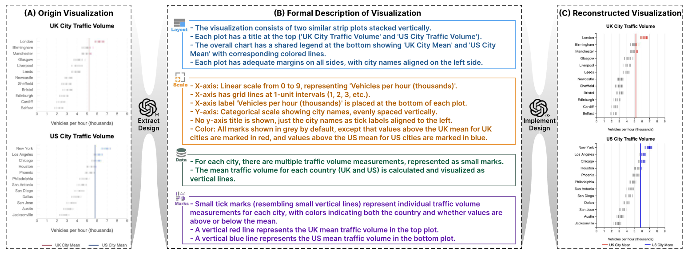
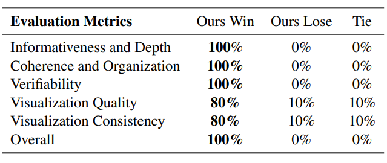

# Multimodal DeepResearcher: Generating Text-Chart Interleaved Reports From Scratch with Agentic Framework

<p align="center">
  <a href="https://arxiv.org/abs/2506.02454/" target="_blank"></a>
  <a href="https://rickyang1114.github.io/multimodal-deepresearcher/" target="_blank"></a>
  <a href="https://huggingface.co/papers/2506.02454" target="_blank"></a>
  <a href="https://www.youtube.com/watch?v=zGYwByishW8" target="_blank"></a> 
</p>

We introduce an **agentic framework** that automatically generates comprehensive multimodal reports **from scratch** with **interleaved texts and visualizations**, going beyond text-only content generation.

This repo hosts the source code of the demo website for the project. Code will be released upon paper acceptance.

## Overall Framework


Multimodal DeepResearcher decomposes the task of multimodal report generation into four stages: (A) erative researching about given topic; (B) Exemplar textualization of multimodal reports from human experts using proposed **Formal Description of Visualization (FDV)**; (C) Planning; (D) Report Generation, which generates the final report with crafting, coding and iterative refinement.

## Formal Description of Visualization (FDV)



We propose FDV, a structured textual representation of charts that enables Large Language Models to learn from and generate diverse, high-quality visualizations.

## Experiments
Our task requires generating a multimodal report from scratch, which is infeasible with direct
prompting or existing deep research frameworks. We incorporate our researching module and adapt the framework of [DataNarrative](https://aclanthology.org/2024.emnlp-main.1073/) accordingly to establish our
baseline.

We develop both automatic evaluation (MLLM-as-a-judge) and human evaluation with five dedicated evaluation metrics. Here are the results:

Automatic evaluation results:


Human Evaluation results:


## Acknowledgement

The demo website is built upon the template from [Tailwind Nextjs Starter Blog](https://github.com/timlrx/tailwind-nextjs-starter-blog). The original README for the template is [here](README-tailwind-started-blog.md).

We are inspired by many previous works. To name a few, [DataNarrative](https://github.com/saidul-islam98/DataNarrative), [PPT Agent](https://github.com/icip-cas/PPTAgent) and previous deep research frameworks, such as [deep-research](https://github.com/dzhng/deep-research), [node-DeepResearch](https://github.com/jina-ai/) and [manus](https://manus.im/).

## Citation
If you find our work interesting, consider citing us via:

```bibtex
@misc{yang2025multimodaldeepresearchergeneratingtextchart,
    title={Multimodal DeepResearcher: Generating Text-Chart Interleaved Reports From Scratch with Agentic Framework}, 
    author={Zhaorui Yang and Bo Pan and Han Wang and Yiyao Wang and Xingyu Liu and Minfeng Zhu and Bo Zhang and Wei Chen},
    year={2025},
    eprint={2506.02454},
    archivePrefix={arXiv},
    primaryClass={cs.CL},
    url={https://arxiv.org/abs/2506.02454}, 
}
```